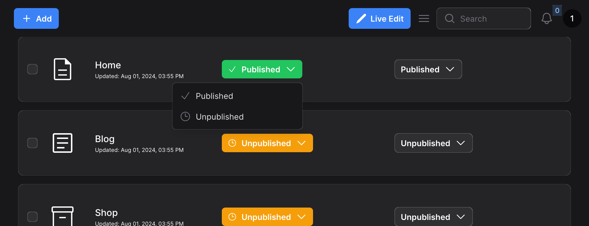

# Filament Dropdown Column




[](https://packagist.org/packages/bobimicroweber/filament-dropdown-column)
[](https://github.com/bobimicroweber/filament-dropdown-column/actions?query=workflow%3Arun-tests+branch%3Amain)
[](https://github.com/bobimicroweber/filament-dropdown-column/actions?query=workflow%3A"Fix+PHP+code+styling"+branch%3Amain)
[](https://packagist.org/packages/bobimicroweber/filament-dropdown-column)


This is where your description should go. Limit it to a paragraph or two. Consider adding a small example.

## Installation

You can install the package via composer:

```bash
composer require bobimicroweber/filament-dropdown-column
```

You can publish and run the migrations with:

```bash
php artisan vendor:publish --tag="filament-dropdown-column-migrations"
php artisan migrate
```

You can publish the config file with:

```bash
php artisan vendor:publish --tag="filament-dropdown-column-config"
```

Optionally, you can publish the views using

```bash
php artisan vendor:publish --tag="filament-dropdown-column-views"
```

This is the contents of the published config file:

## Usage

Simple
```php
DropdownColumn::make('is_active')
    ->size('sm')
    ->options([
    1 => 'Published',
    0 => 'Unpublished',
])
```

Advanced with icons and colors
```php
DropdownColumn::make('is_active')
    ->size('sm')
    ->options([
        1 => 'Published',
        0 => 'Unpublished',
    ])
    ->icon(fn (string $state): string => match ($state) {
        '0' => 'heroicon-o-clock',
        '1' => 'heroicon-o-check',
        default => 'heroicon-o-clock',
    })
    ->color(fn (string $state): string => match ($state) {
        '0' => 'warning',
        '1' => 'success',
        default => 'gray',
    }),
```

## Testing

```bash
composer test
```

## Changelog

Please see [CHANGELOG](CHANGELOG.md) for more information on what has changed recently.

## Contributing

Please see [CONTRIBUTING](.github/CONTRIBUTING.md) for details.

## Security Vulnerabilities

Please review [our security policy](../../security/policy) on how to report security vulnerabilities.

## Credits

- [Bozhidar Slaveykov](https://github.com/bobimicroweber)
- [All Contributors](../../contributors)

## License

The MIT License (MIT). Please see [License File](LICENSE.md) for more information.
